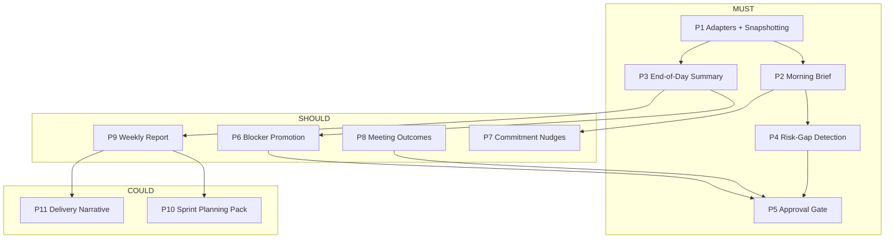
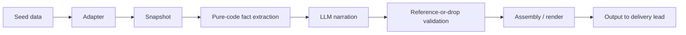
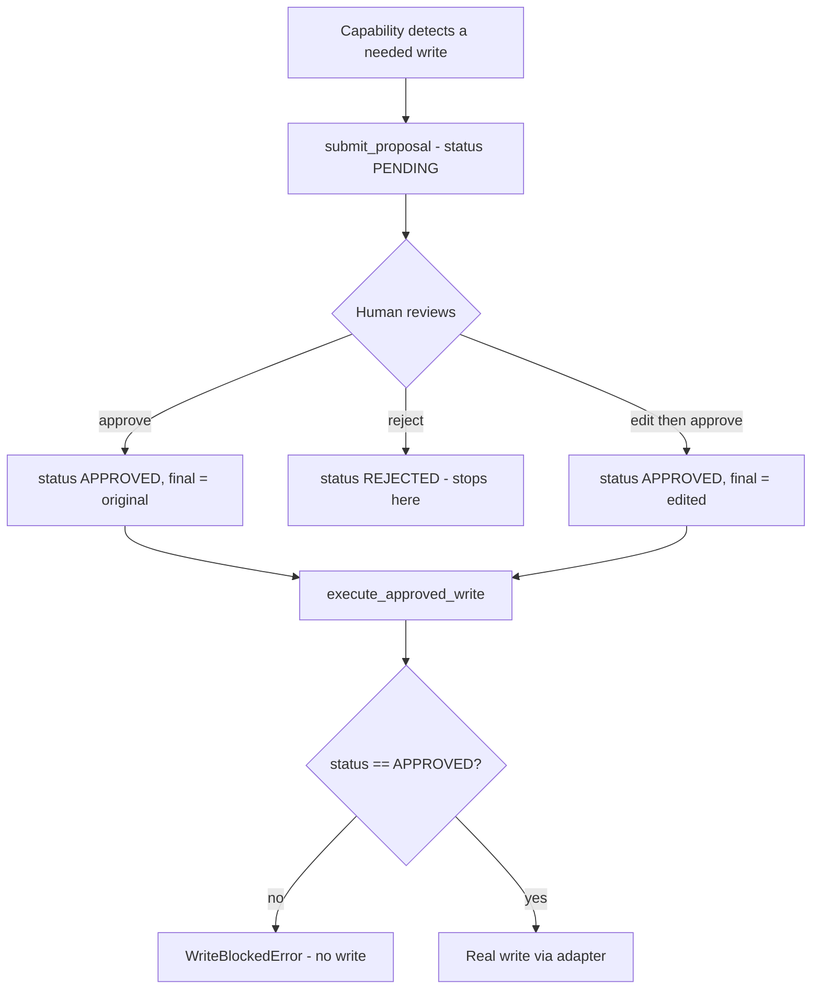

# Delivery Steward — PM Agent

An agent that reports project state honestly to a delivery lead every day, proposes (but never makes) writes to project systems, and never states progress it cannot point to real evidence for.

Built as a 7-day intern challenge. The brief's task catalog and scope are deliberately larger than 7 days can fully polish — this submission prioritizes getting every capability functionally correct and rigorously tested over spending remaining time on visual polish.

## Status table

| # | Capability | Tier | Status | Notes |
|---|---|---|---|---|
| P1 | Adapters + snapshotting | MUST | Done | 4 core adapters (Tracker/CodeHost/Chat/Notification) + RiskLog/ProposalStore, all behind interfaces, all pulled from one central factory |
| P2 | Morning brief | MUST | Done | Schema-constrained narration, reference-or-drop validation, real scheduler |
| P3 | End-of-day summary | MUST | Done | Genuine deltas (not a repeat of the morning), same-day flaps collapsed correctly |
| P4 | Risk-log gap detection | MUST | Done | Proposal-gated, dedup on rejection, write execution verified |
| P5 | Approval gate | MUST | Done | Enforced at the service layer, not just the UI - proven by an automated test attacking the write function directly |
| P6 | Blocker-to-risk promotion | SHOULD | Done | Threshold is genuine config, proven by comparing two threshold values |
| P7 | Commitment nudges and escalation | SHOULD | Done | Built against seeded commitments only (see decision log) |
| P8 | Meeting-outcome consumption | SHOULD | Done | Consent is a hard gate; refusal logged, never silently dropped |
| P9 | Weekly status report | SHOULD | Done | Draft only, agent never sends |
| P10 | Sprint planning pack | COULD | Done | No write path exists (never applied automatically), so no Proposal machinery - see decision log |
| P11 | Delivery narrative | COULD | Done | Correlation only, never cause - see decision log |
| - | Eval harness | Required | Done | 12 cases: the brief 9 (matching their spec exactly) + 3 disclosed bonus cases |
| - | Real scheduler with clock override | Required | Done | APScheduler, scheduler/clock.py supports demo overrides |
| - | MCP tool integration | Bonus | Done | 5 tools exposing morning brief, EOD summary, and the approval flow - see docs/mcp_schema.md |
| - | Approval UI (Streamlit) | Bonus | Done | 9 tabs covering the full functional scope (morning brief, EOD summary, blocker promotion, commitments, meeting outcomes, weekly report, sprint planning, delivery narrative, approval queue with approve/reject/edit-then-approve and a full audit trail) - ui/approval_app.py |

**Not built:** anything beyond the above. No real external integrations (by design — mocks only, per the brief's ground rules). No auth/multi-tenancy. No visual UI beyond console output.


## Why this stack

- **Python 3.11** — fastest language to move in for this scope, and the toolkit doc's own suggested default.
- **Local Ollama (qwen2.5:7b-instruct)** — zero cost, zero rate limit, zero network dependency; the toolkit doc explicitly notes smaller local models "need tighter prompts and stricter output schemas," which this project treats as a real constraint to design against (see the grounding/reference-or-drop discipline throughout), not a shortcut.
- **SQLite** — the toolkit doc's own "default choice — zero setup," appropriate at this project's scale (a handful of tables, no concurrent-write pressure).
- **APScheduler** — a real, demonstrable scheduler rather than a manually-triggered button standing in for one, per the ground rules' explicit warning against that substitution.
- **No agent-orchestration framework** — plain functions with a fixed pipeline (facts → narration → validation → render), not a dispatch loop, because a dispatch loop would let the model decide what happens next - which conflicts with this project's core discipline that code always decides and the model only narrates.

## Setup

```bash
git clone https://github.com/SharonSilva/PM-Delivery-Stewart-Agent.git
cd PM-Delivery-Stewart-Agent
python3.11 -m venv venv
source venv/bin/activate
pip install -r requirements.txt
cp .env.example .env
# requires Ollama running locally with the model pulled:
ollama pull qwen2.5:7b-instruct
```

**Run the unit test suite** (parsing/validation logic, isolated from the LLM):
```bash
python3.11 -m pytest tests/ -v
```

**Run the eval harness:**
```bash
python3.11 eval/run_golden_cases.py
```

**Run a single capability manually**, e.g. the morning brief:
```bash
python3.11 -c "
from scheduler.morning_brief_job import run_morning_brief_job
run_morning_brief_job()
"
```

**Run the approval UI** (the review-and-approve surface):
```bash
streamlit run ui/approval_app.py
```

**Run the MCP server** (exposes the agent as tools other MCP clients can call):
```bash
python3.11 mcp_server/server.py
```
Schema documented at [docs/mcp_schema.md](docs/mcp_schema.md).

**Reset to a clean demo state** (clears accumulated test-run state — proposals, logs, LLM cache — never touches the committed seed data):
```bash
python3.11 scripts/reset_for_demo.py
```

Setup verified from a genuinely fresh virtual environment as part of this submission.


## Diagrams

### The 11 capabilities, by tier



### Core pipeline (the shape every capability follows)



### Approval gate



## Architecture

Full detail in [docs/architecture.md](docs/architecture.md).

**Layering:** every capability follows the same shape — pure-code fact extraction → schema-constrained LLM narration → reference-or-drop validation → assembly/render. The model is only ever asked to phrase a fact that code has already computed; it is never asked to compute or judge a fact itself. Where the model has been given a fact and asked only to phrase it (e.g. a weekly velocity direction), its output is still validated and discarded in favor of a deterministic fallback if it contradicts the given fact.

**Adapters:** `TrackerAdapter`, `CodeHostAdapter`, `ChatAdapter`, `NotificationAdapter`, `RiskLogAdapter`, `ProposalStoreAdapter` — each a narrow ABC interface listing only the operations actually used. `adapters/adapter_factory.py` is the single place any capability obtains a concrete instance, reading `ADAPTER_MODE` from config; a real integration would be added as one new implementation class plus one new branch in the factory, with zero changes to any capability's logic. No mock/concrete class is imported anywhere outside the factory itself and the mocks/ package.

**Approval gate:** `Proposal` (models/proposal.py) is the single abstraction every write-producing capability uses — status (pending/approved/rejected), original payload, final payload (differs from original only on edit-then-approve), approver, timestamps. `approval/write_gate.py`'s `execute_approved_write` is the *only* path to a real write, and it structurally cannot execute anything not marked approved — this is enforced in the data model itself, not just in a calling convention, and is proven by Golden Case 6 attacking the service layer directly.

**Scheduling:** `scheduler/clock.py` provides a single shared clock all jobs read from, with a settable override for demos so "today" can be pinned to a specific date in the seed data. `scheduler/scheduler_app.py` wires all 6 scheduled jobs to real cron-style triggers via APScheduler.

**Storage:** SQLite for proposals and snapshots; local JSON/JSONL files for seed data and inspectable write logs (notifications, refusals). No capability's business logic touches these directly — always through an adapter.

## Deliberate scope decisions (see [docs/decision_log.md](docs/decision_log.md) for full detail)

- **P7** was built against seeded commitments only, not auto-fed by P8's approved meeting-outcome actions — treated as a real, separate design question rather than a small wiring task.
- **P9's "the week"** is sprint-start-to-latest-snapshot, not a fabricated fixed 7-day window, since the real data doesn't span a full week yet — disclosed explicitly in the report itself.
- **P10 has no approval-gate/Proposal machinery** — the spec states this capability is never applied to the tracker automatically, so there is no write to gate, and building the machinery anyway would imply a nonexistent action.
- **P11 only ever states temporal coincidence, never cause** — the seed data has no causal-mechanism information, so any causal claim would be invented. Hedged language is enforced by a hard validator, not just prompt wording.

## Eval results

Committed at `eval/results.txt`, regenerated by `python3.11 eval/run_golden_cases.py`. All 12 cases (the brief's 9 + 3 disclosed bonus cases covering P9/P10/P11) pass, verified idempotent across repeated runs.

## Known limitations

- Local Ollama has no rate limit, so real rate-limit-error handling was never triggered or demonstrated — the disclosed approach for a hosted API is in `docs/rate_limit_disclosure.md`.
- The weakest part of this build, honestly: [to be filled in after the demo recording, per the brief's own requirement for genuine self-assessment].
